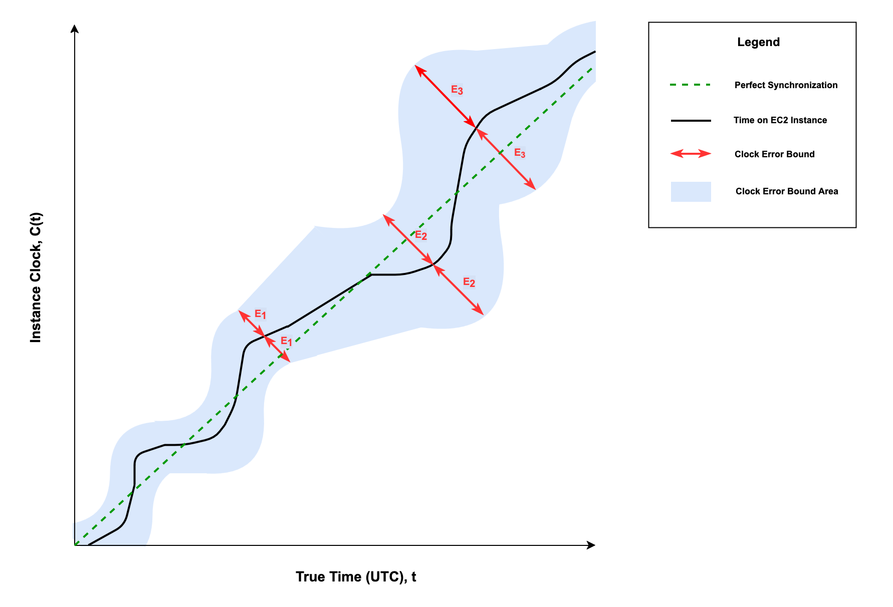

# ClockBound

## Summary

ClockBound allows you to generate and compare bounded timestamps that include accumulated error as reported from the local chronyd process. On every request, ClockBound uses two pieces of information: the current time and the associated absolute error range, which is also known as the clock error bound. This means that the “true” time of a ClockBound timestamp is within a set range.

Using ClockBound with a consistent, trusted time service will allow you to compare timestamps to determine order and consistency for events and transactions, independent from the instances’ respective geographic locations. We recommend you use the Amazon Time Sync Service,  a highly accurate and reliable time reference that is natively accessible from Amazon EC2 instances, to get the most out of ClockBound on your AWS infrastructure. For more information on the Amazon Time Sync Service and configuration with PTP Hardware Clocks or the NTP endpoints, see the [EC2 User Guide](https://docs.aws.amazon.com/AWSEC2/latest/UserGuide/set-time.html).

## Calculations

Clock accuracy is a measure of clock error, typically defined as the offset to UTC. This clock error is the difference between the observed time on the computer and reference time (also known as true time). In NTP architecture, this error can be bounded using three measurements that are defined by the protocol:

- Local offset (the system time): The residual adjustment to be applied to the operating system clock.
- Root dispersion: The accumulation of clock drift at each NTP server on the path to the reference clock.
- Root delay: The accumulation of network delays on the path to the reference clock.

The clock error bound is calculated using the formula below:

> Clock Error Bound = |Local Offset| + Root Dispersion + (Root Delay / 2)

Figure 1: The Clock Error Bound provides a bound on the worst case offset of a clock with regard to “true time”.

The combination of local offset, root dispersion, and root delay provides us with a clock error bound. For a given reading of the clock C(t) at true time t, this bound makes sure that true time exists within the clock error bound. The clock error bound is used as a proxy for clock accuracy and measures the worst case scenario (see Figure 1). Therefore, clock error bound is the main metric used to determine the accuracy of a NTP service.

ClockBound uses this clock error bound to return a bounded range of timestamps. This is calculated by adding and subtracting the clock error bound from the timestamp provided by a system's clock. It also contains functionality to check if a given timestamp is in the past or future. This allows users to have consistency when dealing with time sensitive transactions.

## Usage

To be able to use ClockBound, you must run the ClockBound daemon and make use of a ClockBound client to communicate with the daemon. ClockBound clients are provided as a C library and as a Rust library.

[ClockBound Daemon](clock-bound-d/README.md) - A daemon to provide clients with an error bounded timestamp interval.

[ClockBound Client FFI](clock-bound-ffi/README.md) - A C client library to communicate with ClockBound daemon.

[ClockBound Client Rust](clock-bound-client/README.md) - A Rust client library to communicate with ClockBound daemon.

Please see the respective README.md files for information about how to get these set up.

### Custom Client

The [ClockBound Protocol](docs/PROTOCOL.md) is provided if there is interest in creating a custom client.

Clients can be created in any programming language that can read from a shared memory segment that is backed by a file.

## Security

See [CONTRIBUTING](CONTRIBUTING.md#security-issue-notifications) for more information.

## License

clock-bound-d is licensed under the [GPL v2 LICENSE](clock-bound-d/LICENSE).

clock-bound-ffi is licensed under the [Apache 2.0 LICENSE](clock-bound-ffi/LICENSE).

clock-bound-client is licensed under the [Apache 2.0 LICENSE](clock-bound-client/LICENSE).

