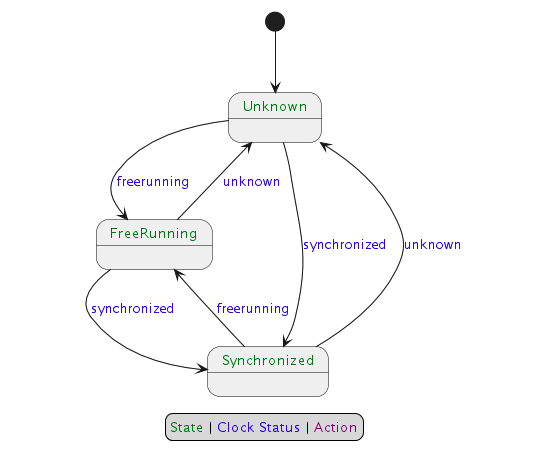

# ClockBound daemon

## Overview

The ClockBound daemon `clockbound` interfaces with the Chrony daemon `chronyd` and the Operating System clock to provide clients with a bound on the error of the system clock. The ClockBound daemon periodically updates a shared memory segment that stores parameters to calculate the bound on clock error at any time. The ClockBound clients open the shared memory segment and read a timestamp interval within which true time exists.

The ClockBound daemon has support for features that are provided by the Linux [VMClock](#VMClock). When the VMClock indicates that a clock disruption has occurred, the ClockBound daemon will communicate with Chrony and tell it to resynchronize the clock. The ClockBound client via its API will present an accurate representation of the clock status while this occurs.

If the ClockBound daemon is running in an environment where clock disruptions are not expected to occur, the ClockBound daemon can be started with CLI option `--disable-clock-disruption-support`. This CLI option will bypass the requirement to have VMClock available and ClockBound will not handle clock disruptions.

## Prerequisites

### The synchronization daemon - chronyd

The ClockBound daemon continuously communicates with Chrony daemon [chronyd](https://chrony-project.org/) to compose the clock error bound parameters. The Chrony daemon must be running to synchronize the system clock and provide clock correction parameters.

#### Chrony installation

- If running on Amazon Linux 2, Chrony daemon `chronyd` is already set as the default NTP daemon for you.
- If running on Amazon EC2, see the [EC2 User Guide](https://docs.aws.amazon.com/AWSEC2/latest/UserGuide/set-time.html) for more information on installing `chronyd` and syncing to the Amazon Time Sync Service.

#### Chrony permissions

The Chrony daemon `chronyd` has the ability to drop privileges once initialized. The rest of this guide assumes that `chronyd` runs under the `chrony` system user, which is the default for most distributions.

Note that this impacts which process can communicate with `chronyd`. The ClockBound daemon `clockbound` communicates with Chrony daemon `chronyd` over Unix Datagram Socket (usually at `/var/run/chrony/chronyd.sock`). The Chrony daemon sets permissions such that only processes running under `root` or the `chrony` user can write to it.

#### Chrony configuration

**IMPORTANT: configuring the maxclockerror directive**

Several sources of synchronization errors are taken into account by `clockbound` to provide the guarantee that true time is within a clock error bound interval. One of these components captures the stability of the local oscillator the system clock is built upon. By default, `chronyd` uses a very optimistic value of 1 PPM, which is appropriate for a clock error _estimate_ but not for a _bound_. The exact value to use depends on your hardware (you should check), otherwise, a value of 50 PPM should be appropriate for most configuration to capture the maximum drift in between clock updates.

Update the `/etc/chrony.conf` configuration file and add the following directive to configure a 50 PPM max drift rate:

```
# Ensures chronyd grows local dispersion at a rate that is realistic and
# aligned with clockbound.
maxclockerror 50
```

```sh
# Restart chronyd to ensure the configuration change is applied.
sudo systemctl restart chronyd
```

### VMClock

The VMClock is a vDSO-style clock provided to VM guests.

During maintenance events, VM guests may experience a clock disruption and it is possible that the underlying clock hardware is changed. This violates assumptions made by time-synchronization software running on VM guests. The VMClock allows us to address this problem by providing a mechanism for user-space applications such as ClockBound to be aware of clock disruptions, and take appropriate actions to ensure correctness for applications that depend on clock accuracy.

For more details, see the description provided in file [vmclock-abi.h](https://github.com/torvalds/linux/blob/master/include/uapi/linux/vmclock-abi.h).

The VMClock is included by default in:

- Amazon Linux 2 `kernel-5.10.223-211.872.amzn2` and later.
- Amazon Linux 2023 `kernel-6.1.102-108.177.amzn2023` and later.
- Linux kernel `6.13` and later.

If you are running a Linux kernel that is mentioned above, you will see VMClock at file path `/dev/vmclock0`, assuming that the cloud provider supports it for your virtual machine.

Amazon Web Services (AWS) is rolling out VMClock support on EC2. This is being added first on AWS Graviton, with Intel and AMD following soon after.

#### VMClock configuration

VMClock at path `/dev/vmclock0` may not have the read permissions needed by ClockBound. Run the following command to add read permissions.

```sh
sudo chmod a+r /dev/vmclock0
```

## Installation

#### Cargo

ClockBound daemon can be installed using Cargo. Instructions on how to install Cargo can be found at [doc.rust-lang.org](https://doc.rust-lang.org/cargo/getting-started/installation.html).

Install dependencies:

```sh
sudo yum install gcc
```

Run cargo build with the release flag:

```sh
cargo build --release
```

Cargo install will place the ClockBound daemon binary at this relative path:

```
target/release/clockbound
```

Optionally, copy the ClockBound daemon binary to the `/usr/local/bin` directory:

```sh
sudo cp target/release/clockbound /usr/local/bin/
```

## Configuration

### One off configuration

The ClockBound daemon `clockbound` needs to:

- Write to a shared memory segment back by a file in `/var/run/clockbound/shm0`.
- Read from and write to chrony UDS socket.
- Read from a shared memory segment provided by the VMClock kernel module at file path `/dev/vmclock0`.  This is not required if `clockbound` is started with the `--disable-clock-disruption-support` option.
- Have a `--max-drift-rate` parameter that matches `chronyd` configuration.

```sh
# Set up ClockBound permissions.
sudo mkdir -p /run/clockbound
sudo chmod 775 /run/clockbound
sudo chown chrony:chrony /run/clockbound
sudo chmod a+r /dev/vmclock0

# Start the ClockBound daemon.
sudo -u chrony /usr/local/bin/clockbound --max-drift-rate 50
```

#### Systemd configuration

The rest of this section assumes the use of `systemd` to control the `clockbound` daemon.

- Create unit file `/usr/lib/systemd/system/clockbound.service` with the following contents.
- Note that:
  - The `clockbound` daemon runs under the `chrony` user to access `chronyd` UDS socket.
  - The aim is to ensure the `RuntimeDirectory` that contains the file backing the shared memory segment is preserved over clockbound restart events. This lets client code run without interruption when the clockbound daemon is restarted.
  - Depending on the version of systemd used (>=235), the `RuntimeDirectory` can be used in combination with
    `RuntimeDirectoryPreserve`.


**Systemd version >= 235**

```ini
[Unit]
Description=ClockBound

[Service]
Type=simple
Restart=always
RestartSec=10
PermissionsStartOnly=true
ExecStartPre=/bin/chmod a+r /dev/vmclock0
ExecStart=/usr/local/bin/clockbound --max-drift-rate 50
RuntimeDirectory=clockbound
RuntimeDirectoryPreserve=yes
WorkingDirectory=/run/clockbound
User=chrony
Group=chrony

[Install]
WantedBy=multi-user.target
```

**Systemd version < 235**

```ini
[Unit]
Description=ClockBound

[Service]
Type=simple
Restart=always
RestartSec=10
PermissionsStartOnly=true
ExecStartPre=/bin/chmod a+r /dev/vmclock0
ExecStartPre=/bin/mkdir -p /run/clockbound
ExecStartPre=/bin/chmod 775 /run/clockbound
ExecStartPre=/bin/chown chrony:chrony /run/clockbound
ExecStartPre=/bin/cd /run/clockbound
ExecStart=/usr/local/bin/clockbound --max-drift-rate 50
WorkingDirectory=/run/clockbound
User=chrony
Group=chrony

[Install]
WantedBy=multi-user.target
```

- Reload systemd and install and start the `clockbound` daemon

```sh
sudo systemctl daemon-reload
sudo systemctl enable clockbound
sudo systemctl start clockbound
```

- You can then check the status of the service with:

```sh
systemctl status clockbound
```

- Logs are accessible at `/var/log/daemon.log` or through

```sh
# Show the ClockBound daemon logs.
sudo journalctl -u clockbound

# Follow the ClockBound daemon logs.
sudo journalctl -f -u clockbound
```

## Clock status

The value of the clock status written to the shared memory segment is driven by the Finite State Machine described below. The clock status exposed is a combination of the clock status known by chronyd as well as the disruption status.

Each transition in the FSM is triggered by either:

- An update retrieved from Chrony with the clock status which can be one of: `Unknown`, `Synchronized`, `FreeRunning`.
- An update retrieved from VMClock to signal clock disruption. Disruption status is one of: `Unknown`, `Reliable`, `Disrupted`.


If ClockBound daemon was started with CLI option `--disable-clock-disruption-support`, then the FSM is as follows:



## PTP Hardware Clock (PHC) Support on EC2

### Configuring the PHC on Linux and Chrony.

Steps to setup the PHC on Amazon Linux and Chrony is provided here:

- https://docs.aws.amazon.com/AWSEC2/latest/UserGuide/configure-ec2-ntp.html

On non-Amazon Linux distributions, the ENA Linux driver will need to be installed and configured with support for the PHC enabled:

- https://github.com/amzn/amzn-drivers/tree/master/kernel/linux/ena

### Configuring ClockBound to use the PHC.

To get accurate clock error bound values when `chronyd` is synchronizing to the PHC (since `chronyd` assumes the PHC itself has 0 error bound which is not necesarily true), a PHC reference ID and PHC network interface (i.e. ENA interface like eth0) need to be supplied for ClockBound to read the clock error bound of the PHC and add it to `chronyd`'s clock error bound. This can be done via CLI args `-r` (ref ID) and `-i` (interface). Ref ID is seen in `chronyc tracking`, i.e.:

```
$ chronyc tracking
Reference ID    : 50484330 (PHC0) <-- This 4 character ASCII code
Stratum         : 1
Ref time (UTC)  : Wed Nov 15 18:24:30 2023
System time     : 0.000000014 seconds fast of NTP time
Last offset     : +0.000000000 seconds
RMS offset      : 0.000000060 seconds
Frequency       : 6.614 ppm fast
Residual freq   : +0.000 ppm
Skew            : 0.019 ppm
Root delay      : 0.000010000 seconds
Root dispersion : 0.000001311 seconds
Update interval : 1.0 seconds
Leap status     : Normal
```

and network interface should be the primary network interface (from `ifconfig`, the interface with index 0) - on Amazon Linux 2 this will generally be `eth0`, and on Amazon Linux 2023 this will generally be `ens5`.

For example:
```
/usr/local/bin/clockbound -r PHC0 -i eth0
```

To have your systemd unit do this, you'll need to edit the above line to supply the right arguments.

For example:
```ini
[Unit]
Description=ClockBound

[Service]
Type=simple
Restart=always
RestartSec=10
PermissionsStartOnly=true
ExecStartPre=/bin/chmod a+r /dev/vmclock0
ExecStart=/usr/local/bin/clockbound --max-drift-rate 50 -r PHC0 -i eth0
RuntimeDirectory=clockbound
RuntimeDirectoryPreserve=yes
WorkingDirectory=/run/clockbound
User=chrony
Group=chrony

[Install]
WantedBy=multi-user.target
```


## Testing clock disruption support

### Manual testing - VMClock

ClockBound reads from the VMClock to know that the clock is disrupted.

If you would like to do testing of ClockBound, simulating various VMClock states, one possibility is to use the vmclock-updater CLI tool.

See the vmclock-updater [README.md](../test/vmclock-updater/README.md) for more details.

### Manual testing - POSIX signal

The ClockBound daemon supports triggering fake clock disruption events.

Sending POSIX signal `SIGUSR1` to the ClockBound process turns clock disruption status ON.

Sending POSIX signal `SIGUSR2` to the ClockBound process turns clock disruption status OFF.

Quick example, assuming ClockBound is running with PID 1234, starting not disrupted:

```sh
# Send a SIGUSR1 signal to ClockBound
kill -SIGUSR1 1234
```

The ClockBound daemon emits a log message indicating it is entering a forced disruption period.

> 2023-10-05T05:25:11.373568Z INFO main ThreadId(01) clock-bound-d/src/main.rs:40: Received SIGUSR1 signal, setting forced clock disruption to true

An application using libclockbound will then see a clock status indicating the clock is "DISRUPTED".

```sh
# Send a SIGUSR2 signal to ClockBound
kill -SIGUSR2 1234
```

The ClockBound daemon emits a log message indicating it is leaving a forced disruption period.

> 2023-10-05T05:25:19.590361Z INFO main ThreadId(01) clock-bound-d/src/main.rs:40: Received SIGUSR2 signal, setting forced clock disruption to false

