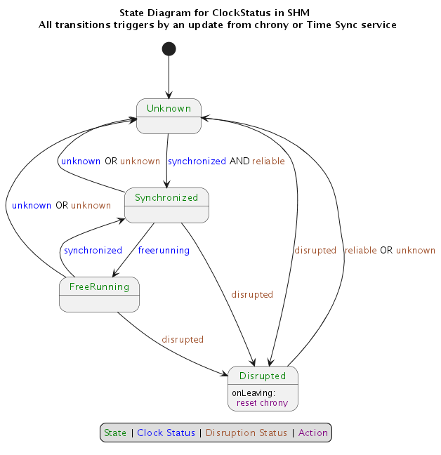

[](https://crates.io/crates/clock-bound-d)
[](https://www.gnu.org/licenses/old-licenses/gpl-2.0.en.html)

# ClockBound daemon

## Overview

The `clockbound` daemon interfaces with `chronyd` and the Operating System clock to provide clients with a bound on the
error of the system clock. The `clockbound` daemon periodically updates a shared memory segment that stores parameters
to calculate the bound on clock error at any time. Clients leverage the C library (in `clock-bound-ffi/`)
or the Rust library (in `clock-bound-client/`) to open the shared memory segment and read a timestamp interval
within which true time exists.

## Prerequisites

### The synchronization daemon - chronyd

The `clockbound` daemon continuously communicates with [chronyd](https://chrony.tuxfamily.org/) to compose the clock
error bound parameters. The `chronyd` daemon must be running to synchronize the system clock and provide clock
correction parameters.

#### Chrony installation

- If running on Amazon Linux 2, `chronyd` is already set as the default NTP daemon for you.
- If running on Amazon EC2, see the [EC2 User Guide](https://docs.aws.amazon.com/AWSEC2/latest/UserGuide/set-time.html)
  for more information on installing `chronyd` and syncing to the Amazon Time Sync Service.

#### Chrony permissions

The `chronyd` daemon has the ability to drop privileges once initialized. The rest of this guide assumes that `chronyd`
runs under the `chrony` system user, which is the default for most distributions.

Note that this impacts which process can communicate with `chronyd`. The `clockbound` daemon communicates with `chronyd`
over `chronyd` Unix Datagram Socket (usually at `/var/run/chrony/chronyd.sock`). The `chronyd` daemon sets permissions
such that only processes running under `root` or the `chrony` user can write to it.

#### Chrony configuration

**IMPORTANT: configuring the maxclockerror directive**

Several sources of synchronization errors are taken into account by `clockbound` to provide the guarantee that true time
is within a clock error bound interval. One of these components captures the stability of the local oscillator the
system clock is built upon. By default, `chronyd` uses a very optimistic value of 1 PPM, which is appropriate for a
clock error _estimate_ but not for a _bound_. The exact value to use depends on your hardware (you should check),
otherwise, a value of 50 PPM should be appropriate for most configuration to capture the maximum drift in between clock
updates.

Update the `/etc/chrony.conf` configuration file and add the following directive to configure a 50 PPM max drift rate:

```text
# Ensures chronyd grows local dispersion at a rate that is realistic and aligned with clockbound.
maxclockerror 50
```

## Installation

### Cargo

ClockBound daemon can be installed using Cargo. Instructions on how to install Cargo can be found at
[doc.rust-lang.org](https://doc.rust-lang.org/cargo/getting-started/installation.html).

If it's your first time installing Cargo on an AL2 EC2 instance you may need to also install gcc:

```sh
sudo yum install gcc
```

Run cargo build with the release flag:

```sh
cargo build --release
```

Cargo install will place the ClockBound daemon binary in this relative path:

```sh
target/release/clockbound
```

## Configuration

### Systemd configuration

If built from source using cargo, it is recommended to set up systemd to manage the ClockBound daemon.

In the below systemd configuration, please note:

- The `clockbound` daemon runs as the `chrony` user so that it can access the chronyd UDS socket
  at `/var/run/chrony/chronyd.sock`.
- The `RuntimeDirectory` that contains the file backing the shared memory segment needs to be
  preserved over clockbound restart events. This lets client code run without interruption
  when the clockbound daemon is restarted.
- Depending on the version of systemd used (>=235), the `RuntimeDirectory` can be used in combination with
  `RuntimeDirectoryPreserve`.

Configuration steps:

Move binary to the location you want to run it from:

```sh
sudo mv target/release/clockbound /usr/local/bin/clockbound
sudo chown chrony:chrony /usr/local/bin/clockbound
```

Create unit file `/usr/lib/systemd/system/clockbound.service`.
The contents of this file will vary depending on what version of systemd that you are running.

To determine the version of systemd that you are running, run `systemctl --version`.

In the example below, the systemd version is 219.

```sh
$ systemctl --version
systemd 219
+PAM +AUDIT +SELINUX +IMA -APPARMOR +SMACK +SYSVINIT +UTMP +LIBCRYPTSETUP +GCRYPT +GNUTLS +ACL +XZ +LZ4 -SECCOMP +BLKID +ELFUTILS +KMOD +IDN
```

For systemd version >= 235 create file `/usr/lib/systemd/system/clockbound.service` with the following contents:

```text
[Unit]
Description=ClockBound

[Service]
Type=simple
Restart=always
RestartSec=10
ExecStart=/usr/local/bin/clockbound --max-drift-rate 50
RuntimeDirectory=clockbound
RuntimeDirectoryPreserve=yes
WorkingDirectory=/run/clockbound
User=chrony
Group=chrony

[Install]
WantedBy=multi-user.target
```

For systemd version < 235 create file `/usr/lib/systemd/system/clockbound.service` with the following contents:

```text
[Unit]
Description=ClockBound

[Service]
Type=simple
Restart=always
RestartSec=10
PermissionsStartOnly=true
ExecStartPre=/bin/mkdir -p /run/clockbound
ExecStartPre=/bin/chmod 775 /run/clockbound
ExecStartPre=/bin/chown chrony:chrony /run/clockbound
ExecStartPre=/bin/cd /run/clockbound
ExecStart=/usr/local/bin/clockbound --max-drift-rate 50
User=chrony
Group=chrony

[Install]
WantedBy=multi-user.target
```

Reload systemd:

```sh
sudo systemctl daemon-reload
```

Enable ClockBound daemon to start at boot:

```sh
sudo systemctl enable clockbound
```

Start ClockBound daemon:

```sh
sudo systemctl start clockbound
```

You can then check the status of the service with:

```sh
systemctl status clockbound
```

Logs are accessible at `/var/log/daemon.log` or by running the following command:

```sh
sudo journalctl -u clockbound
```

### One-off Manual Configuration

The following steps are primarily here for developer or testing purposes.

The ClockBound daemon needs to:

- Write to a shared memory segment that is backed by file `/var/run/clockbound/shm`.
- Read from and write to chrony UDS socket at `/var/run/chrony/chronyd.sock`.
  This is permitted if the `clockbound` daemon runs as the user `chrony`.
- Have a `--max-drift-rate` parameter that matches `chronyd` configuration.

Commands to support that ClockBound daemon setup:

```sh
sudo mkdir /var/run/clockbound
sudo chown root:chrony /var/run/clockbound
sudo chmod g+rwx /var/run/clockbound
sudo -u chrony /usr/local/bin/clockbound --max-drift-rate 50
```

## Usage

To communicate with the ClockBound daemon, a client is required.

- See [clock-bound-ffi](../clock-bound-ffi/README.md) for a C library that an application can use to communicate with the ClockBound daemon.
- See [clock-bound-client](../clock-bound-client/README.md) for a Rust client library.

## Clock status

The value of the clock status written to the shared memory segment is driven by the Finite State Machine described below.

Each transition in the FSM is triggered by an update retrieved from chrony with the clock status which can be one of `Unknown`, `Synchronized`, or `FreeRunning`.



### PTP Hardware Clock (PHC) Support on EC2

To get accurate clock error bound values when `chronyd` is synchronizing to the PHC (since `chronyd` assumes the PHC itself has 0 error bound which is not necesarily true), a PHC reference ID and PHC network interface (i.e. ENA interface like eth0) need to be supplied for ClockBound to read the clock error bound of the PHC and add it to `chronyd`'s clock error bound. This can be done via CLI args `-r` (ref ID) and `-i` (interface). Ref ID is seen in `chronyc tracking`, i.e.:
```
$ chronyc tracking
Reference ID    : 50484330 (PHC0) <-- This 4 character ASCII code
Stratum         : 1
Ref time (UTC)  : Wed Nov 15 18:24:30 2023
System time     : 0.000000014 seconds fast of NTP time
Last offset     : +0.000000000 seconds
RMS offset      : 0.000000060 seconds
Frequency       : 6.614 ppm fast
Residual freq   : +0.000 ppm
Skew            : 0.019 ppm
Root delay      : 0.000010000 seconds
Root dispersion : 0.000001311 seconds
Update interval : 1.0 seconds
Leap status     : Normal
```
and network interface should be the primary network interface (from `ifconfig`, the interface with index 0) - on Amazon Linux 2 this will generally be `eth0`, and on Amazon Linux 2023 this will generally be `ens5`.

For example:
```
/usr/local/bin/clockbound -r PHC0 -i eth0
```

To have your systemd unit do this, you'll need to edit the above line to supply the right arguments.

For example:
```
[Unit]
Description=ClockBound

[Service]
Type=simple
Restart=always
RestartSec=10
ExecStart=/usr/local/bin/clockbound -r PHC0 -i eth0
RuntimeDirectory=clockbound
RuntimeDirectoryPreserve=yes
WorkingDirectory=/run/clockbound
User=chrony
Group=chrony

[Install]
WantedBy=multi-user.target
```

## Security

See [CONTRIBUTING](../CONTRIBUTING.md#security-issue-notifications) for more information.

## License

Licensed under the [GPL v2](LICENSE) license.
